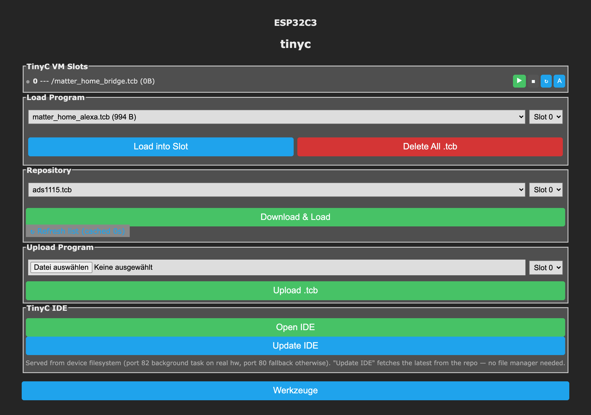
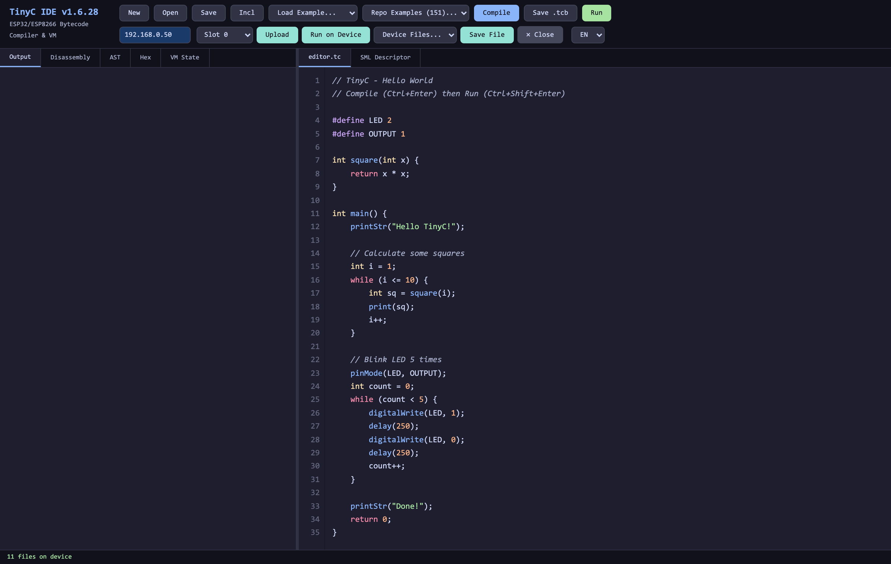

# TinyC — C Scripting for Tasmota

TinyC is a C-subset compiler and VM that runs on ESP32/ESP8266 as Tasmota driver `XDRV_124`. Write C code in the browser IDE, compile to bytecode, upload and run — no firmware rebuild needed.

> **Current firmware: v1.6.46** — pre-built `.bin` / `.factory.bin` for ESP32 / ESP32-S3 / ESP32-C3 / ESP32-C6 / ESP8266 and the matching `tinyc_ide.html.gz` are attached to every release.
>
> * [**All releases**](https://github.com/gemu2015/Sonoff-Tasmota/releases) — one `v<version>` release per build. Watch the repository (*Custom → Releases*) to be notified when a new one appears.
> * [`testing`](https://github.com/gemu2015/Sonoff-Tasmota/releases/tag/testing) — a rolling tag that always carries the newest assets, for stable download URLs. It is deliberately reused, so it never fires a release notification.
>
> The full per-version changelog lives in the `TC_RELEASE` comment in `tasmota/include/xdrv_124_tinyc_vm.h`.

## What's new (v1.6.28 highlights)

- **Update the IDE from the console** — new `TinyCIde` command + an **Update IDE** button on the TinyC Console (`/tc`) fetch the latest `tinyc_ide.html.gz` from the repository and replace the served IDE on the device — no file manager needed. See [Updating the IDE from the console](#updating-the-ide-from-the-console-no-file-manager).
- **Matter, pure-C (`matter_c`)** — a from-scratch Matter 1.4 stack (no Berry, no HomeKit): define the device in a `.tc` script (`matterAdd` / `matterSetFloat` / `matterName`) and pair from the `/mt` web page. Sensors, plugs, lights (incl. RGB/CCT), power meter, air quality. **Works on Apple Home, Google Home AND Amazon Alexa** — including the full mixed actuators+sensors bridge on one node. See `examples/matter_*.tc`.
- **ESP32-S3 Mini support** — a build for the 4 MB-flash / 2 MB **quad-PSRAM** S3 module (e.g. Lolin/Wemos S3 Mini, chip ESP32-S3FH4R2); a compact dual-core Matter host. See [TinyC_Custom_Builds.md](TinyC_Custom_Builds.md).
- **Bluetooth LE scripting** (`USE_TINYC_BLE`) — `bleScan` + a GATT client (`bleTarget` / `bleReadStart` / …); reads e.g. an Etekcity ESF37 body-composition scale. See `examples/ble_scan.tc`.
- **eBUS active master** (`USE_SML_EBUS_MASTER`, xsns_53) — query non-broadcast eBUS values via `smlWrite`, with adapter-delegated arbitration.
- **Tasmota Workbench** — the Mac/Windows/Linux companion tool (`utils/tasmota_workbench/`): a serial + UDP-syslog monitor, a LAN device scanner with **per-device sensor + relay/lamp detection**, an OTA flasher, and a multicast-share monitor.

## Earlier — What's new in v1.6.14

- **DMX512 TX via RMT** — `dmxInit(gpio)` (single GPIO, no UART consumed). Frame built as `rmt_symbol_word_t[]` and pushed through `rmt_new_tx_channel` + copy encoder at 1 MHz — hardware-clocked BREAK/MAB/250 kbaud, no busy-wait, all UARTs stay free for SML/Modbus/`tc_serial`. 30 s watchdog forces all-zero so a dimmer can safe-off. See `examples/dmx_dimmer_panel.tc`.
- **Boot-loop false-positive fix (1.6.11)** — rapid back-to-back `Restart 1`s no longer leave the four slots marked `autoexec=0`. Real PANIC/WDT/BROWNOUT loops still trip the protection.
- **Persist `.pvs.bak` safety net (1.6.10)** — every successful persist save keeps the previous snapshot as `slot-N_<name>.pvs.bak`; one `cp` recovers a layout-hash-wiped state without JSON-restore.
- **WebOn / WebUI halted-wait fix (1.6.10)** — `webOn()` callbacks no longer return spurious `503` if the VM is momentarily halted on the other core during a page poll.
- **IDE auto-injects `TC_RELEASE` + `TC_MAX_HEAP`** — `bundle.py` reads them from `xdrv_124_tinyc_vm.h` at bundle time, so banner version + heap-warning threshold always match the firmware. Heap budget is now a *warning*, not a hard block (device is the gate).
- **New example: `persist_array_file`** — script-managed binary persistence via `fileReadBin` / `fileWriteBin` for buffers larger than the `persist` keyword's per-slot budget. (For human-readable text storage use `fileReadArray` / `fileWriteArray`, which read/write **float** values as TAB-separated CSV.)
- **`serial_monitor` utility rewrite** — Windows + Linux support, OTA flasher (LAN scan → `OtaUrl` + `Upgrade`), serial esptool flasher with `--no-stub` fallback, ESP32 partition-table view, isolated esptool install. Lives under `tasmota/tinyc/utils/serial_monitor/`.

## Key Advantages

- **Portable bytecode** — compile once in the browser, run the same binary on ESP32, ESP32-S3, ESP32-C3, or ESP8266. No recompilation needed per target.
- **No on-device compiler** — compilation happens in the browser IDE, so no parser/codegen ships in firmware. The bytecode interpreter loop itself is tiny, but the full shipped TinyC subsystem (VM + ~70 syscalls + web widgets + browser-IDE serving + hardware/HomeKit/camera bridges) is **≈196 KB flash** on a 4 MB ESP32 build (hand-measured) — still far smaller than embedding a compiler, but budget for it on tight 4 MB targets.
- **Compact binary upload** — bytecode is smaller than source text, reducing upload time and filesystem usage.
- **Instant execution** — uploaded bytecode runs immediately, no parsing or compilation step on the device.
- **Familiar C syntax** — no new language to learn. Standard C subset with `int`, `float`, arrays, functions, `for`/`while`/`if` — anyone who knows C can write TinyC.
- **10× faster than text interpreters** — the bytecode VM with direct-threaded dispatch executes significantly faster than script engines that re-parse source text on every statement.
- **True background tasks** — `TaskLoop()` runs in a dedicated FreeRTOS task (ESP32) with full `delay()` support. Long-running loops, sensor polling, and protocol handling never block the main Tasmota loop. Other script engines share the main loop and cannot use blocking delays without stalling WiFi, MQTT, and the web server.

## Building Tasmota with TinyC

Add the following to your `user_config_override.h`:

```c
#define USE_TINYC           // Enable TinyC VM (XDRV_124)
#define USE_TINYC_IDE       // Enable self-hosted browser IDE (requires USE_UFILESYS)
```

`USE_TINYC` enables the VM and console commands. `USE_TINYC_IDE` adds the `/tinyc_ide.html` endpoint that serves the IDE directly from flash — requires a filesystem-enabled build (`USE_UFILESYS`).

After compiling and flashing Tasmota, upload the IDE file to the device filesystem:

1. Grab `tinyc_ide.html.gz` from the [`testing` release](https://github.com/gemu2015/Sonoff-Tasmota/releases/tag/testing) (or run `bash bundle.sh` to build it)
2. Upload `tinyc_ide.html.gz` to the device via **Consoles > Manage File System** (or `http://<device-ip>/ufsd`)
3. Open the **TinyC Console** at `http://<device-ip>/tc` and click **Open IDE** (the IDE is served on a background task, port 82 on ESP32)
4. Write code, press **Ctrl+Enter** to compile, **Ctrl+Shift+Enter** to run

The TinyC Console (`/tc`) is the per-device control page — VM slots, load/upload bytecode, and the IDE buttons:



### Updating the IDE from the console (no file manager)

Once the IDE is on the device you can update it to the latest repo build straight from the **TinyC Console** — no file manager, no PC. Click **Update IDE**, or run:

```
TinyCIde            # fetch the latest tinyc_ide.html.gz from the repo
TinyCIde <url>      # …or from a specific URL (e.g. a branch / self-hosted build)
```

It downloads `tinyc_ide.html.gz`, validates it (gzip magic + size), then atomically replaces the served IDE — a failed or truncated download keeps the old one. (The ~190 KB write briefly pauses running scripts.)

The browser IDE itself — editor, compile/run, disassembly / AST / hex / VM-state views, and the device bar (IP · slot · upload · run-on-device):



## Language

Standard C subset: `int`, `float`, `char`, `void`, `bool` types. Control flow with `if/else`, `while`, `for`, `switch/case`, `break`, `continue`. Functions, 1D and 2D arrays (`char buf[N][M]`, `int grid[R][C]`, `float coef[R][C]` — auto-promoted to heap above 16 elements), structs, `#define` preprocessor, `// line` and `/* block */` comments. No pointers.

## Tasmota Integration

Callbacks run automatically from Tasmota's main loop:

| Callback | When | Use |
|---|---|---|
| `EveryLoop()` | Every main loop (~1-5ms) | Ultra-fast polling, bit-banging |
| `Every50ms()` | Every 50ms | Fast I/O, radio polling |
| `EverySecond()` | Every 1s | Sensor polling, status updates |
| `JsonCall()` | MQTT telemetry | Append JSON via `responseAppend()` |
| `WebCall()` | Web page refresh | Add sensor rows via `webSend()` |
| `WebPage()` | Page load (once) | Charts, custom HTML |
| `UdpCall()` | UDP packet received | Inter-device communication |
| `TaskLoop()` | FreeRTOS task (ESP32) | Background loop with `delay()` support |
| `TouchButton(btn, val)` | Touch event | GFX button/slider touch callback |
| `HomeKitWrite(dev, var, val)` | HomeKit write | Control lights, switches, outlets from Apple Home |
| `MatterInvoke(ep, cluster, cmd)` | Matter command | Handle controller commands (OnOff/Level/Color) on your Matter endpoints |
| `Command(char cmd[])` | Custom console command | Handle registered prefix commands (e.g., MP3Play) |
| `OnExit()` | Script stop | Close serial ports, release resources |

`main()` runs first (in a FreeRTOS task on ESP32, with full `delay()` support). After `main()` returns, globals persist and callbacks activate. If `TaskLoop()` is defined, it continues running in the same task independently of the main thread.

## Built-in Functions

**GPIO:** `pinMode`, `digitalWrite`, `digitalRead`, `analogRead`, `analogWrite`, `gpioInit`
**Timing:** `delay`, `delayMicroseconds`, `millis`, `micros`
**Timers:** `timerStart`, `timerDone`, `timerStop`, `timerRemaining`
**Serial:** `serialBegin`, `serialPrint`, `serialPrintInt`, `serialPrintFloat`, `serialPrintln`, `serialRead`, `serialAvailable`
**1-Wire:** `owSetPin`, `owReset`, `owWrite`, `owRead`, `owWriteBit`, `owReadBit`, `owSearchReset`, `owSearch`
**Math:** `abs`, `min`, `max`, `map`, `random`, `sqrt`, `sin`, `cos`, `floor`, `ceil`, `round`
**Strings:** `strlen`, `strcpy`, `strcat`, `strcmp`, `printString`, `printStr`, `strToken`, `strSub`, `strFind`
**Format:** `sprintf`, `sprintfAppend` (auto-detect type; legacy: `sprintfInt`, `sprintfFloat`, `sprintfStr`, `sprintfAppendInt`, `sprintfAppendFloat`, `sprintfAppendStr`)
**I2C:** `i2cRead8`, `i2cWrite8`, `i2cRead`, `i2cWrite`, `i2cExists`, `i2cRead0`, `i2cWrite0`, `i2cSetDevice`, `i2cSetActiveFound`
**SPI:** `spiInit`, `spiSetCS`, `spiTransfer`
**Files:** `fileOpen`, `fileClose`, `fileRead`, `fileWrite`, `fileExists`, `fileDelete`, `fileSize`, `fileFormat`, `fileMkdir`, `fileRmdir`, `fileReadArray`, `fileWriteArray`, `fileLog`, `fileDownload`, `fileGetStr`, `fileExtract`, `fileExtractFast`, `fsInfo`
**Time:** `timeStamp`, `timeConvert`, `timeOffset`, `timeToSecs`, `secsToTime`
**Tasmota:** `tasmCmd`, `sensorGet`, `responseAppend`, `webSend`, `webFlush`, `addLog`, `addLogLevel`, `addCommand`, `responseCmnd`
**HTTP:** `httpGet`, `httpPost`, `httpHeader`
**TCP:** `tcpServer`, `tcpClose`, `tcpAvailable`, `tcpRead`, `tcpWrite`, `tcpReadArray`, `tcpWriteArray`, `tcpConnect`, `tcpDisconnect`, `tcpConnected`, `tcpSelect` (4 parallel client slots)
**MQTT:** `mqttSubscribe`, `mqttUnsubscribe`, `mqttPublish` + `OnMqttData(topic, payload)` callback (10 subs, `#` prefix wildcard)
**Dynamic tasks (ESP32):** `spawnTask`, `killTask`, `taskRunning` — up to 4 concurrent named FreeRTOS tasks sharing the caller's VM state (one-shot delayed jobs, parallel downloaders, killable workers)
**Cross-VM share (ESP32):** `shareSetInt`/`shareGetInt`, `shareSetFloat`/`shareGetFloat`, `shareSetStr`/`shareGetStr`, `shareHas`, `shareDelete` — 32-key driver-global table for sharing scalars/strings between TinyC slots when one program is split across two slots. Mutex-protected. Missing-key reads return `0`/`0.0`/`""`
**UDP:** `udpRecv`, `udpReady`, `udpSendArray`, `udpRecvArray`, `udp` (general-purpose, modes 0-7) — scalar `global` floats auto-broadcast on assignment
**Display:** `dspText`, `dspClear`, `dspPos`, `dspFont`, `dspSize`, `dspColor`, `dspDraw`, `dspPad`, `dspPixel`, `dspLine`, `dspRect`, `dspFillRect`, `dspCircle`, `dspFillCircle`, `dspHLine`, `dspVLine`, `dspRoundRect`, `dspFillRoundRect`, `dspTriangle`, `dspFillTriangle`, `dspDim`, `dspOnOff`, `dspUpdate`, `dspPicture`, `dspWidth`, `dspHeight`, `dspTextWidth`, `dspTextHeight`
**Image Store:** `dspLoadImage`, `dspPushImageRect`, `dspImageWidth`, `dspImageHeight`, `dspImgText`, `dspLoadImageFromCam`, `dspImgTextBurn`, `dspImageToCam` — PSRAM image slots for flicker-free compositing + cam ↔ image bridge for burning timestamps/labels into JPEG captures
**Touch Buttons:** `dspButton`, `dspTButton`, `dspPButton`, `dspSlider`, `dspButtonState`, `touchButton`
**Audio:** `audioVol`, `audioPlay`, `audioSay`
**Deep Sleep:** `deepSleep`, `deepSleepGpio`, `wakeupCause`
**Email:** `mailBody`, `mailAttach`, `mailSend`
**Persist:** `persist` keyword for auto-saved variables, `saveVars` for manual save
**Watch:** `watch` keyword for change detection, `changed`, `delta`, `written`, `snapshot` intrinsics
**WebUI:** `webButton`, `webToggle`, `webSlider`, `webCheckbox`, `webText`, `webNumber`, `webPulldown`, `webRadio`, `webTime`, `webPageLabel`, `webPage`, `webSendFile`, `webOn`, `webHandler`, `webArg`
**SML:** `smlGet`, `smlGetStr`, `smlGetV`, `smlWrite`, `smlRead`, `smlSetBaud`, `smlSetWStr`, `smlSetOptions`, `smlCopy`, `smlApplyPins`, `smlScripterLoad`
**mDNS:** `mdnsRegister`
**System:** `tasm_wifi`, `tasm_mqttcon`, `tasm_teleperiod`, `tasm_uptime`, `tasm_heap`, `tasm_pheap`, `tasm_maxblock`, `tasm_frag`, `tasm_power`, `tasm_dimmer`, `tasm_temp`, `tasm_hum`, `tasm_hour`, `tasm_minute`, `tasm_second`, `tasm_year`, `tasm_month`, `tasm_day`, `tasm_wday`, `tasm_cw`, `tasm_sunrise`, `tasm_sunset`, `tasm_time`
**HomeKit:** `hkSetCode`, `hkAdd`, `hkVar`, `hkReady`, `hkStart`, `hkReset`, `hkStop` + `HomeKitWrite(dev, var, val)` callback
**Matter (ESP32, `USE_MATTER_C`):** `matterReset`, `matterAdd`, `matterCluster`, `matterAttr`, `matterSet`, `matterGet`, `matterStart` + `MatterInvoke(ep, cluster, cmd)` callback — declare Matter endpoints (plug, light, sensors) from a script; the pure-C `matter_c` engine handles commissioning + the Interaction Model. Mutually exclusive with HomeKit (same build slot). See `examples/matter_plug.tc`, `matter_rgb.tc`
**Bluetooth LE (ESP32, `USE_TINYC_BLE`):** scan — `bleScan`, `bleScanStop`, `bleNext`, `bleMac`, `bleAddrType`, `bleRssi`, `bleName`, `bleMfg`; GATT client — `bleTarget`, `bleReadStart`, `bleWriteStart`, `bleDone`, `bleResult`. Built on the common-BLE driver (`USE_BLE_ESP32`, ≈+292 KB flash); non-blocking (poll in `TaskLoop`); auto-enables BLE (no `SetOption115`). See `examples/ble_scan.tc`
**LED Strip:** `setPixels(array, len, offset)` — WS2812/NeoPixel strip; `rgbLed(gpio, 0xRRGGBB)` — single on-board WS2812
**I2S Audio:** `i2sBegin(bclk, lrclk, dout, rate)`, `i2sWrite(pcm, frames)`, `i2sStop` — raw PCM streaming (e.g. WAV playback with `fileReadPCM16`)
**DMX512 (ESP32 via RMT):** `dmxInit(gpio)`, `dmxWrite(channel, value)` — TX-only, hardware-clocked BREAK/MAB/250 kbaud 8N2, 16 slots default (`TC_DMX_SLOTS`), 30 s all-zero watchdog. No UART consumed
**Debug:** `print`, `dumpVM`

## Predefined Constants

**Colors (RGB565):** 16 colors available without `#define`: `BLACK`, `WHITE`, `RED`, `GREEN`, `BLUE`, `YELLOW`, `CYAN`, `MAGENTA`, `ORANGE`, `PURPLE`, `GREY`, `DARKGREY`, `LIGHTGREY`, `DARKGREEN`, `NAVY`, `MAROON`, `OLIVE`

**HomeKit Types:** `HK_TEMPERATURE`, `HK_HUMIDITY`, `HK_LIGHT_SENSOR`, `HK_BATTERY`, `HK_CONTACT`, `HK_SWITCH`, `HK_OUTLET`, `HK_LIGHT`

**File Modes:** `r` (read), `w` (write), `a` (append) — for `fileOpen()`

## Tasmota Commands

| Command | Description |
|---|---|
| `TinyC` | Show VM status (all slots) |
| `TinyCRun [s] [/f]` | Run slot s (default 0), optionally load /f first |
| `TinyCStop [s]` | Stop slot s (default 0) |
| `TinyCReset [s]` | Reset slot s (default 0) |
| `TinyCExec <n>` | Set instructions per tick (default 1000) |
| `TinyCInfo 0\|1` | Show/hide VM status rows on main page |
| `TinyCIde [url]` | Update the browser IDE from the repo (or a given URL) — downloads + atomically replaces `/tinyc_ide.html.gz`, no file manager needed (needs `USE_UFILESYS`) |
| `TinyCChkpt` | Show partition table (ESP32 only) |
| `TinyCChkpt p` | Auto-resize app partition to fit firmware, expand filesystem. **Warning: filesystem is formatted!** |
| `TinyCChkpt p <KB>` | Set app partition to specific size in KB |

REST API: `http://<ip>/tc_api?cmd=run`, `cmd=stop`, `cmd=status` (with `slot=` parameter)

File Download Server (port 82, ESP32): `http://<ip>:82/ufs/<filename>` — supports `@from_to` time-range filter

## VM Limits

| Resource | ESP8266 | ESP32 |
|---|---|---|
| Stack depth | 64 | 256 |
| Call frames | 8 | 32 |
| Globals | 64 | dynamic |
| Constants | 32 | 1024 |
| Const data | 512 B | dynamic (DRAM, spills to PSRAM) |
| Code size | 4 KB | 128 KB (DRAM, spills to PSRAM) |
| Heap | 8 KB | 32 KB |
| Heap handles | 8 | 32 |

> **ESP8266 limitation:** The ESP8266 has very limited RAM (~40 KB free heap). TinyC works for simple scripts (sensor reading, MQTT, basic automation), but programs using heap arrays, WS2812 LED strips, or IR together with the Tasmota web UI will cause instability due to memory pressure. For anything beyond trivial scripts, use ESP32, ESP32-S3, or ESP32-C3.

## Examples

See [`examples/`](examples/) for 60+ complete working programs. Highlights:

> **Run one straight from the repo, without the IDE on the device:** a build with
> `USE_TINYC_REPO_IDE` serves `/tcrepo` — a ~6.5 KB page that lists the repo's
> examples, pulls the compiler out of the repo into your browser
> (`tinyc_ide.html.gz`, gunzipped there), compiles, uploads the `.tcb` and starts
> the slot. Nothing but that page lives on the device, and it always compiles with
> whatever the repo currently ships. It has to be served *by the device*: a page on
> an https site cannot talk to a plain-http LAN device at all — browsers block that
> as mixed content before any CORS header is read.

> The `#include` building blocks (`sml_chart_common.tc`, `sml_descriptor.tc`,
> `modbus_lib.tc`, …) live in [`examples/common/`](examples/common/). They have no
> `main()` and are never loaded on their own — the compiler pulls them in by bare
> filename, so `#include "sml_chart_common.tc"` stays as it is. In the on-device IDE,
> load that folder once with **Incl**.

**I2C Sensors:**
- **bme280** / **bmp280** / **bmx280** — Bosch environmental sensors (temperature, humidity, pressure)
- **sht31** — Temperature/humidity (dual-bus scan, address claiming)
- **scd30** — CO2 sensor with auto-calibration
- **sgp30** — VOC/eCO2 air quality
- **sps30** — Particulate matter sensor
- **vl53l0x** — Laser time-of-flight distance (VLMode/VLBudget/VLStatus commands)
- **mlx90614** — Infrared non-contact thermometer
- **tcs34725** — RGB color sensor
- **veml6075** — UV index sensor
- **ltr308** — Ambient light sensor
- **ads1115** — 16-bit ADC
- **ccs811** — eCO2/TVOC
- **lcd_i2c** — HD44780 LCD with console commands

**Display:**
- **display_demo** — Sensor dashboard for ILI9488
- **sunton_display** / **guiton_display** — Sunton/Guition board demos
- **epaper29** — E-paper 2.9" driver
- **text_on_image** — Flicker-free text compositing on JPEG backgrounds
- **analog_clock** — Analog clock with date overlay
- **lcd_chart** / **live_chart** / **chart_types** — Various chart styles
- **touch_buttons** — GFX touch button/slider demo
- **multipage_demo** — Multi-page display navigation

**Protocols & Hardware:**
- **dmx_dimmer_panel** — DMX512 TX via RMT, `@getfreepins` pin pulldown + channel/value sliders
- **bresser** / **bresser_chart** — CC1101 868 MHz weather station receiver
- **onewire** — 1-Wire bus: DS18B20 + DS2406/DS2413/DS2408, GPIO and DS2480B modes
- **max31855** — SPI thermocouple reader
- **dysv17f** — DY-SV17F MP3 player (serial TX, console commands)
- **ld2410** — mmWave presence sensor
- **camera** / **webcam** / **webcam_tinyc** — ESP32 camera drivers
- **ble_scan** — BLE advertisement scanner + device-filter template (`USE_TINYC_BLE`)
- **sml_ebus** — Smart Meter Language / eBUS

**Smart meter (SML) — ottelo's family, one program per setup:**
- **sml_simple** — meter only, smallest program
- **sml_chart** — + charts and tables on their own page, feed-in switchable
- **sml_chart_bezug** — for meters with no export register: the feed-in total is
  integrated from negative power (`SML_PV_TOTAL` points the shared code at it)
- **sml_eco_shelly** / **sml_chart_eco_shelly** — + EcoTracker / Shelly Pro 3EM
  emulator for PV batteries
- **sml_ct002** / **sml_chart_ct002** — + Marstek CT002/CT003 emulator
- Modbus-TCP is built into every one of them. The emulator variants must run in
  **slot 0** — their HTTP endpoints are `webOn` handlers, and Tasmota hands those
  to slot 0. Docs: <https://ottelo9.github.io/tasmota-sml-script/>

**Energy & Automation:**
- **core2_energy** — M5Stack Core2 energy monitor with Shelly 3EM
- **ecotracker** — Energy tracking with daily counters
- **powerwall** — Tesla Powerwall API integration

**Web & Communication:**
- **web_buttons** / **web_handler** / **webui_demo** / **webcall_demo** — Custom web interfaces
- **homekit_demo** / **homekit_office** — Apple HomeKit integration
- **matter_plug** — Matter On/Off smart plug (relay) via the pure-C `matter_c` engine
- **matter_rgb** — Matter dual endpoint: On/Off plug + Extended Color Light on an on-board WS2812 (HSV→RGB)
- **udp** — Multicast data sharing between devices

**Basics:**
- **blink**, **callbacks**, **benchmark**, **fibonacci**, **sort**, **strings**, **file_io**, **sensor_read**, **editor**, **watch_demo**

## VS Code Support

Install the `vscode-tinyc` extension for `.tc` syntax highlighting with full TinyC keyword, builtin, and callback coloring. Copy or symlink to `~/.vscode/extensions/tinyc-1.0.0`.

## Reference

Full language specification: [TinyC_Reference.md](TinyC_Reference.md)
