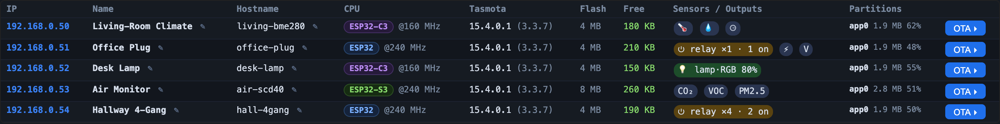

# Tasmota Workbench — ESP/Tasmota Swiss-army knife

A browser-based control surface for ESP devices and Tasmota fleets. One
dependency-light Python server (stdlib + `pyserial`) serving an embedded
single-page UI — no Electron, no build step, no cloud.

It opens at `http://127.0.0.1:8124/`.

Three tabs:

- **📟 Monitor** — a large-scrollback console fed by two capture sources
  (serial port via `pyserial` + UDP syslog from devices over WiFi), with
  one shared ring so timeline cause-and-effect is obvious.
- **🔧 Devices · Scan & OTA** — LAN scan of Tasmota devices (CPU family /
  firmware build / partitions / heap), **per-device sensor + relay/lamp
  detection**, inline rename of `DeviceName` and `Hostname`, OTA-flash one
  or many devices.
- **🛰 Shares** — Tasmota multicast share-protocol monitor (the
  Scripter/TinyC `g:` global-variable broadcast on
  `239.255.255.250:1999`). Live table of which device emits which global,
  clash detection (same name from >1 device), CSV export.

Was previously called "Serial Monitor"; the name shifted as the tool
grew. Settings (last-used port/baud) migrate automatically from
`~/.serial_monitor.json` to `~/.tasmota_workbench.json` on first run.

---

## Quick start

Cross-platform (macOS / Windows / Linux). Needs **Python 3** and
**`pyserial`** (`esptool` only if you serial-flash; the Devices tab can
install it for you in an isolated venv).

| OS | Launch | Get deps |
|----|--------|----------|
| **macOS** | double-click `Tasmota Workbench.app` (no Terminal) or `Tasmota Workbench.command` | Python from python.org; `pip3 install pyserial` |
| **Linux** | `./tasmota_workbench.sh`, or wire up the `.desktop` file | `python3-pip` + `pip3 install --user pyserial`; serial usually needs `usermod -aG dialout $USER` |
| **Windows** | double-click `Tasmota Workbench.bat` | install Python 3 from python.org (tick "Add to PATH"), then `py -m pip install pyserial` |

The browser opens automatically at `http://127.0.0.1:8124/`. The
**Quit** button in the top bar stops the server cleanly.

---

## Monitor pane (📟)

Two capture sources, usable at the same time, feeding the **same** scrollback:

- **Serial** — pick a port from the dropdown (⟳ rescans), pick a baud rate,
  **Connect**. Type commands at the bottom; Enter sends them with the chosen
  EOL (CR LF / LF / CR / none). Toggle **hex** to see byte values, **time**
  to hide timestamps, **autoscroll** to follow live.
- **Syslog** — UDP syslog listener for devices you can NOT reach
  physically. On the device:
  ```
  Backlog LogHost <this PC's IP> ; LogPort 5514 ; SysLog 2
  ```
  Pick a port > 1024 (low ports need root). Each line is tagged with the
  sender IP so multiple devices into one stream stay disambiguated.

The top bar's `IP` dropdown shows this PC's LAN IPs — use 📋 to copy the
one your devices should send to.

**Save** dumps the current scrollback to a file. **Clear** empties the ring.

---

## Devices · Scan & OTA pane (🔧)

- **Firmware** picker (or just type a path) — the chosen `.bin` is staged
  on the server.
- **Mode** = OTA over the LAN (default; uses the device's `/u2`) or
  Serial via esptool.
- For OTA: pick a device from the **Device** dropdown (or click **⟳
  Scan**), type a `WebPassword` if one is set, **Flash**.
- For Serial: pick the port, baud, offset (auto-detected from the bin);
  optional **erase** before flashing.
- The scan table is colour-coded by CPU family. Each device row shows
  IP · Name · Hostname · CPU · Tasmota build · Flash · Free heap ·
  **Sensors / Outputs** · Partitions. The IP is a clickable link to the
  device's web UI.
- **Sensors / Outputs** — the scan also reads each device's `Status 10`
  (`StatusSNS`) and `Status 11` (`StatusSTS`) and shows what it exposes,
  as colour-coded pills:
  - 🔵 **sensors** — temperature · humidity · pressure · illuminance ·
    CO₂ · VOC · PM1/2.5/10 · CO, plus electrical voltage/current/power/
    energy. Each is classified into a Matter sensor type and a
    `Sensor#Attribute` filter path (the scheme Matter HTTP bridges use),
    so the data is ready to bridge an ESP as a remote sensor.
  - 🟠 **relays** — `⏻ relay ×N` (and how many are on), from
    `POWER`/`POWER1…n`.
  - 🟢 **lamps** — `💡 lamp·RGB 80%` etc., classified by channel count
    into on/off · dim · CCT · RGB · RGBW · RGBCCT. A light consumes one
    `POWER` output, so a bulb shows just the lamp and a relay+LED device
    splits cleanly.
  - Hover any cell for the full list with live values
    (`BME280#Temperature = 22.4 °C`, `POWER1 = ON`, …).
- Inline rename via the ✎ icon on Name (`DeviceName`) or Hostname
  (Hostname + Restart).



ESP32-S3/C3 quirks: on those boards, prefer the **USB JTAG/serial debug
unit** port. If `Failed to write to target RAM / Checksum error` appears,
tick **no-stub**. The button also offers to install `esptool` into an
isolated venv if missing.

---

## Shares pane (🛰)

The Tasmota Scripter and TinyC engines broadcast `g:` global variables
on multicast `239.255.255.250:1999`. This pane scans that traffic.

- **Duration** — listen window in seconds (1–600).
- **Start** — bind the multicast group, listen for `Duration` seconds,
  decode each packet, resolve sender device names via HTTP (parallel),
  build the table. **Stop** at any time.
- Results table: per `(device-IP, global)` row → Last value · type
  (ASCII / `bin float` / `bin float[N]`) · packet count · age. Rows
  with a clash (same global emitted by >1 device) are highlighted
  red, with a summary line above the table listing every clash.
- **Export CSV** to download the current rows.

Protocol decoder:

```
text:                    name=value   ← ASCII
binary float scalar:     name:        + 4 bytes  little-endian float32
binary float array:      name:        + 2-byte LE count + N×4 LE floats
                                       (rendered as [v0, v1, …, vN-1])
```

Replaces the previous standalone `udp_monitor/` tool (now removed from
the tree; same protocol decoder).

---

## Cookbook

- **Watch a device that crashes too fast to copy-paste the boot log** —
  serial: Connect at the matching baud; the ring keeps 200 000 lines (env
  override `TASMOTA_WORKBENCH_HISTORY=<lines>`). Power-cycle, hit **Save**
  later to get the file.
- **Watch a device that's already flashed and on WiFi, with no serial
  hookup** — set `LogHost`/`LogPort`/`SysLog 2`, start the syslog
  listener at the same port, leave it running.
- **Find a clashing `g:` global** — Shares tab, 30 s scan, watch for the
  red rows.

---

## Files

| file | role |
|---|---|
| `tasmota_workbench_server.py` | the canonical Python server + embedded SPA |
| `Tasmota Workbench.command` | macOS Terminal launcher |
| `Tasmota Workbench.app` | macOS double-click app bundle (runs its own bundled copy of the .py — TCC-safe on `~/Desktop`) |
| `sync_app.command` | re-sync the bundled copy after editing the canonical .py |
| `tasmota_workbench.sh` | Linux/Unix launcher |
| `Tasmota Workbench.bat` | Windows launcher |
| `Tasmota Workbench.desktop` | Linux `.desktop` entry |
