# Solar Manager — BYD battery + SMA inverter

A community-built TinyC project that turns a Waveshare ESP32-S3-ETH into a
full-featured energy management controller for a residential solar
installation.

**Hardware**: Waveshare ESP32-S3-ETH · BYD HVS 10.24 battery · SMA Tripower
10.0 SE inverter · SMA Home Manager 2.0 · Wallbox Warp3 · Shelly switches.

**Software**: pure TinyC, no Berry / Scripter — uses Modbus/TCP, HTTP webUI
hooks, `forecast.solar` API, Energy Charts day-ahead price API, multi-device
orchestration.

---

## Status display

A built-in TFT displays live battery state — SOC, SoH, charge/discharge
power, lifetime energy throughput, AC/DC efficiency, and the next astronomical
events (sunrise / solar noon / sunset).

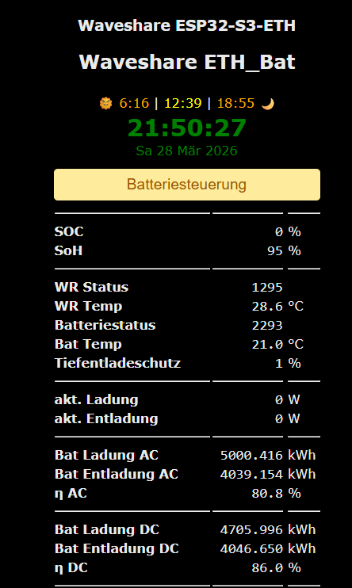{ loading=lazy }

## Main webUI — battery control rules

The browser-served control panel. Operators can switch the battery between
`Normal`, `Blockiert` (blocked) and `Erzwungen` (forced) for charge and
discharge independently. Below, an arbitrary number of charge / discharge
rules can be defined, each combining time windows, SOC thresholds, electricity
price, PV forecast, and current PV output as AND-conditions.

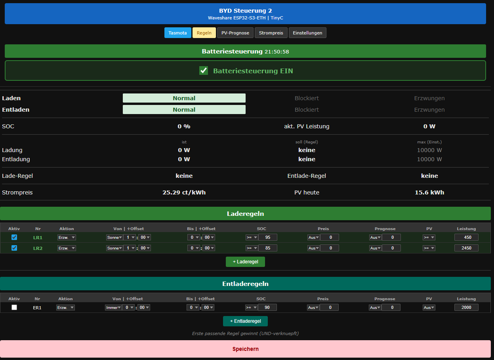{ loading=lazy }

## SOC history

A rolling daily plot of the battery's state-of-charge with colour-coded
operating modes (grid charge / grid feed-in / normal / PV surplus / own use /
blocked). Below the chart: self-consumption ratio, autarky percentage, and
battery cycle counter.

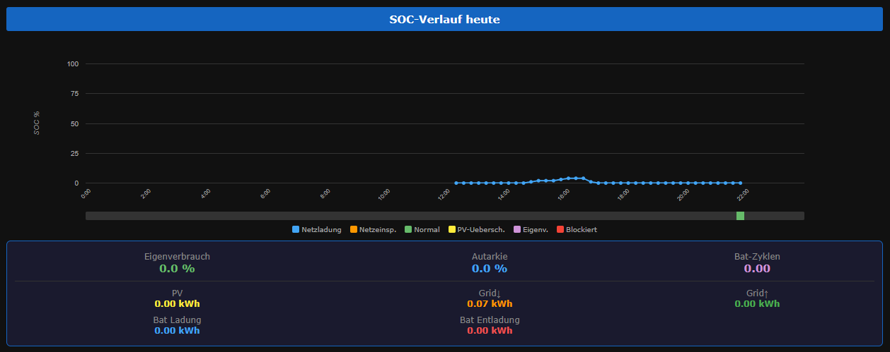{ loading=lazy }

## PV yield forecast

Pulled from the `api.forecast.solar` service for two roof orientations
(NW and SE), with the actual measured DC power overlaid for accuracy
calibration. Today's and tomorrow's totals are shown at the top.

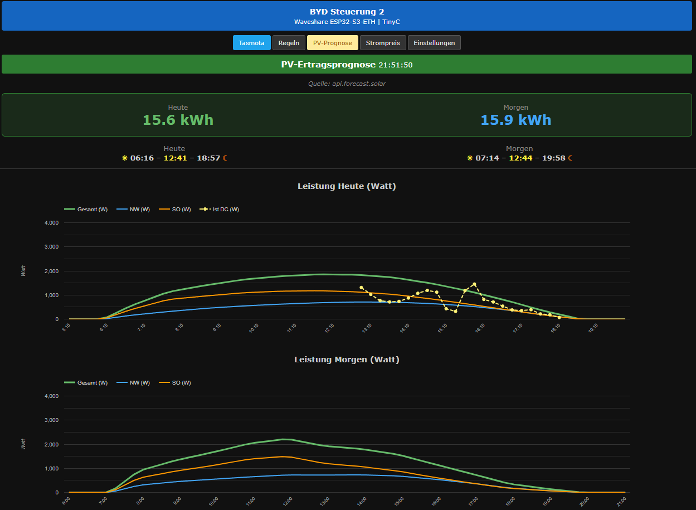{ loading=lazy }

## Electricity pricing — fixed / dynamic / time-of-use

Three pricing models can be selected. The fixed-tariff calculator breaks
down the consumer price into its regulatory components (Netzentgelt, Abgaben,
Steuern) per the German *14a EnWG* framework.

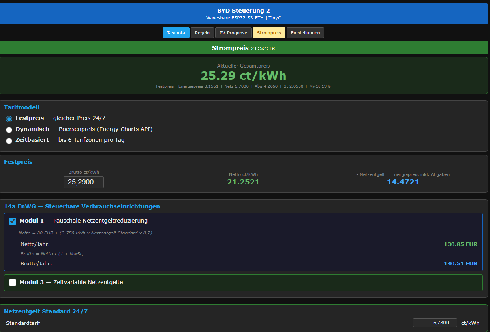{ loading=lazy }

## Flexible grid tariffs (HT / NT / Hochlast)

Per-window time-of-use tariffs with up to three windows for low / standard /
high-load periods, and a fully editable list of grid surcharges and levies.

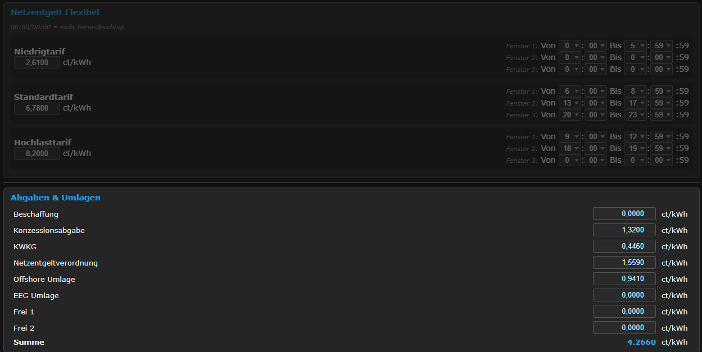{ loading=lazy }

## Net price calculation

Reverse calculation from gross consumer price down to the energy-component
base price (used by the rule engine for break-even decisions).

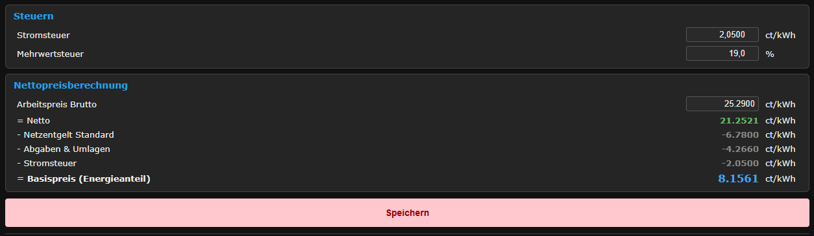{ loading=lazy }

## Day-ahead exchange price

When the dynamic-price model is selected, the Boersenstrompreis page pulls
the day-ahead spot price (EPEX) and visualises it as a coloured bar chart —
green for cheap, orange for premium hours.

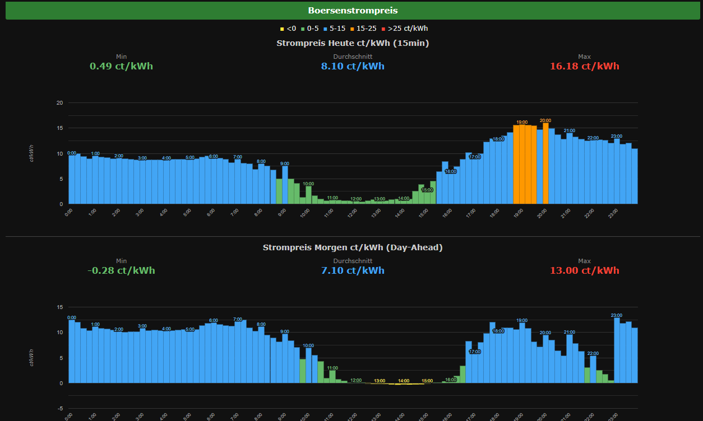{ loading=lazy }

## Shelly orchestration

Up to N Shelly devices (Plug S 1PM, Plug EM, Mini relays …) are auto-discovered
or manually configured by IP. Each device has its own rule list with the same
combinators as the battery rules, so loads can be switched on PV surplus,
cheap-grid windows, or SOC thresholds.

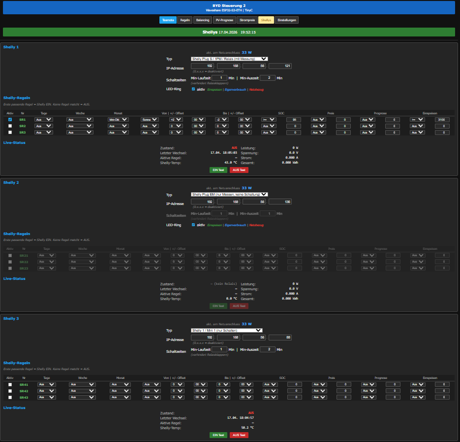{ loading=lazy }

## Settings — inverter & PV plant

Modbus/TCP address of the SMA inverter, max charge/discharge power, plant
location (lat / lon) and per-roof orientation (tilt + azimuth + kWp). A
forecast correction factor calibrates the model to measured reality.

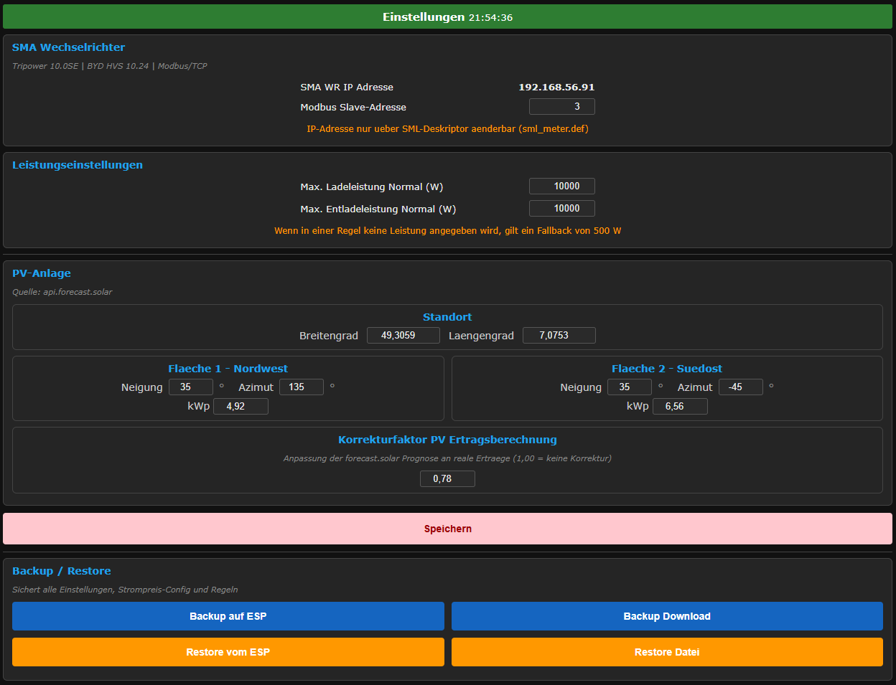{ loading=lazy }

## Settings — network devices & efficiency reference

All connected devices grouped on one page (Home Manager, inverter, BMU,
Wallbox), plus the monthly / yearly / lifetime AC and DC throughput
counters used to compute round-trip efficiency.

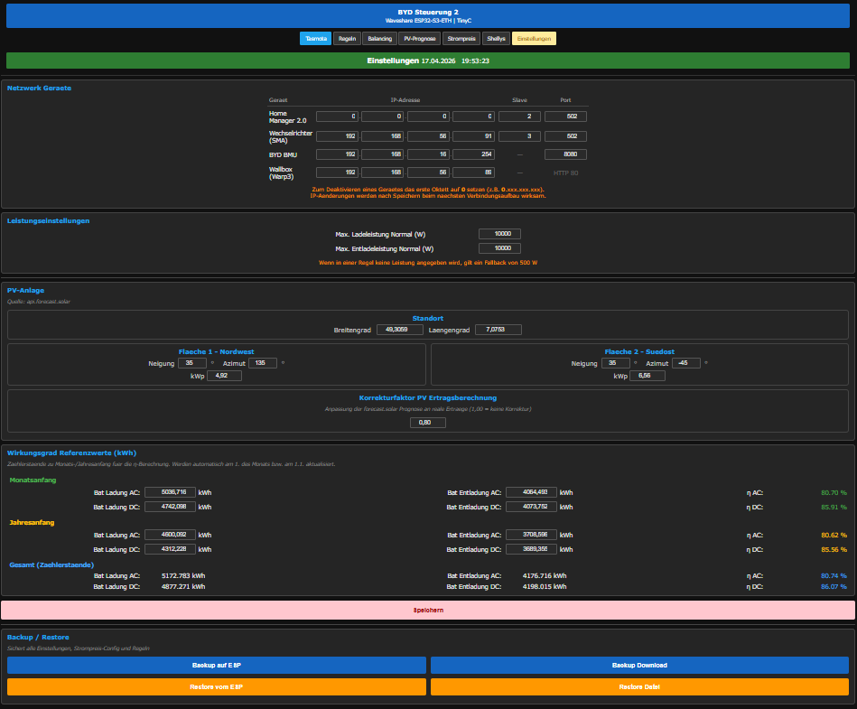{ loading=lazy }

---

!!! tip "Want to build something similar?"
    The complete TinyC source is not yet bundled with the standard examples —
    contact the author or watch the [Releases page](../releases.md) for a
    future drop.
