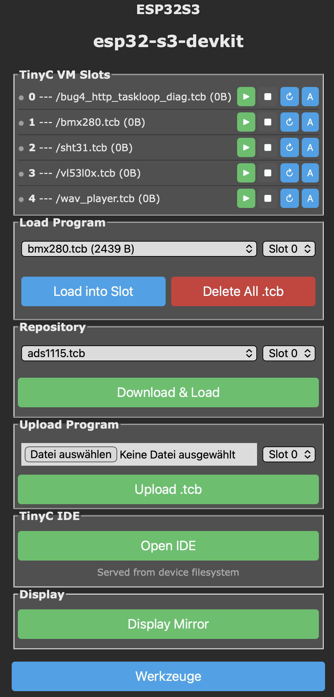

# Getting Started

## 1. Build Tasmota with TinyC

Add the following to your `user_config_override.h`:

```c
#define USE_TINYC         // Enable TinyC VM (XDRV_124)
#define USE_TINYC_IDE     // Self-hosted browser IDE (requires USE_UFILESYS)
```

`USE_TINYC_IDE` adds the `/tinyc_ide.html` endpoint. It requires a filesystem-enabled
build (`USE_UFILESYS`).

Or grab a pre-built binary from the [Releases](releases.md) page and flash it directly.

## 2. Upload the IDE

1. Download `tinyc_ide.html.gz` from the [testing release](https://github.com/gemu2015/Sonoff-Tasmota/releases/tag/testing).
2. In Tasmota, open **Consoles → Manage File System** (or POST to `http://<device>/ufsu`).
3. Upload `tinyc_ide.html.gz` to the root of the filesystem.
4. Open `http://<device-ip>/tinyc_ide.html` in your browser.

The TinyC driver adds its own console page to the Tasmota web UI — one row per VM
slot, program upload, bytecode repository, and a shortcut to open the IDE:

{ loading=lazy }

### Elements on the device console

**TinyC VM Slots** — up to six independent VM instances (0–5). Each row shows
the currently loaded `.tcb` file and its size, followed by four action buttons:

| Button | Action |
|--------|--------|
| :material-play: green | Start / resume the program in this slot |
| :material-stop: dark  | Stop execution and free heap memory |
| :material-refresh: blue | Reload the same `.tcb` from flash and restart |
| **A** blue | Toggle autoexec — this slot runs on every boot |

**Load Program** — pick an existing `.tcb` already on the device filesystem and
load it into the chosen slot. **Delete All .tcb** wipes every compiled bytecode
from flash (not the source `.tc` files on your PC).

**Repository** — online bytecode library. The dropdown lists pre-compiled
examples; **Download & Load** pulls the file to the device and loads it into the
selected slot in one step.

**Upload Program** — push a locally compiled `.tcb` straight to a slot. Useful
during development when you're iterating on a program outside the IDE.

**TinyC IDE** — opens `/tinyc_ide.html` in a new tab (served straight from the
device filesystem; no cloud, no external host).

**Display Mirror** — opens a live browser view of the attached display for
devices with a connected TFT/OLED/e-paper panel.

**Werkzeuge / Tools** — returns to the standard Tasmota **Tools** menu.

## 3. Your first program

```c
void main() {
    addLog("Hello from TinyC!");
}

void EverySecond() {
    float t = temperature();
    char buf[64];
    sprintf(buf, "temp=%.1f C", t);
    addLog(buf);
}
```

- **Ctrl+Enter** compiles.
- **Ctrl+Shift+Enter** uploads + runs.
- **Stop** button halts execution.

Console output appears in the Tasmota **Console** tab.

{ loading=lazy }

### Elements in the browser IDE

**Top toolbar** (left to right):

| Button | Purpose |
|--------|---------|
| **New** | Empty editor + fresh filename |
| **Open** | Load a `.tc` source file from your PC |
| **Save** | Save the current source to your PC |
| **Load Example…** | Pick from ~65 bundled programs (sensors, displays, networking) |
| **-DBOARD_…** | Board / feature-flag preset — sets `#define`s the compiler sees |
| **Compile** | Parse + generate bytecode (output on the left pane) |
| **Run** | Execute the compiled bytecode in the in-browser VM (no device needed) |
| **Upload** | Send the `.tcb` to the connected device's filesystem |
| **Run on Device** | Upload + load into slot + start, all in one click |
| **Device Files…** | List / download / delete files on the device filesystem |
| **Save File** | Save both source and compiled bytecode to the device |
| **Close** | Close the current tab |
| **EN / DE** | UI language toggle |

**Left pane tabs** — compiler introspection:

- **Output** — compiler messages, VM stdout, error locations
- **Disassembly** — human-readable bytecode listing with opcode offsets
- **AST** — parsed syntax tree (useful when a construct isn't compiling as expected)
- **Hex** — raw `.tcb` byte dump for inspection or manual upload
- **VM State** — live registers, stack, heap, and globals while a program runs

**Right pane tabs** — sources:

- **editor.tc** — the TinyC source you're editing
- **SML Descriptor** — separate text buffer for smart-meter descriptor lines; sent
  to the device alongside the program when present

**Status bar (bottom)** — `19 files on device` shows the count of files on the
device's filesystem; updates as you upload or delete.

## 4. Where to go next

- Browse the [function reference](reference.md) — every syscall with signatures and examples.
- Look at the [examples](examples/index.md) — working code for common sensors, displays, and protocols.
- See the [gallery](gallery/index.md) — screenshots of projects on real hardware.
