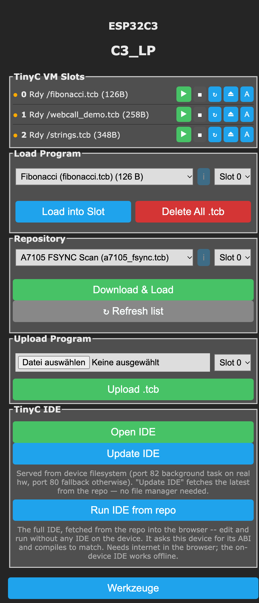

# Getting Started

## 1. Get a firmware with TinyC

The easiest way is a pre-built binary from the [testing release](https://github.com/gemu2015/Sonoff-Tasmota/releases/tag/testing) (see [Releases](releases.md) for what each file is):

| Your device | File |
|---|---|
| ESP32, 4 MB (classic WROOM) | `tinyc32-4M-plain` |
| ESP32-S3, 16 MB (Matter built in, camera, LVGL) | `tinyc32s3` |
| ESP32-C3 | `tinyc32c3` |
| ESP32-C6 | `tinyc32c6` |
| ESP32-P4 (display, camera, audio) | `tinyc32-p4-full` |
| ESP8266, 4 MB (lean, one VM slot) | `tinyc8266-4M` |

- **Fresh install over a cable:** flash the `.factory.bin` with esptool or a web installer. It carries bootloader, partition table and app and **replaces the file system**.
- **Update a running device:** use the `.bin`. Either the **Firmware Upgrade** page, or in the console `OtaUrl <url-of-the-bin>` followed by `Upgrade 1` — the device then fetches the file itself, which is the reliable way on devices with the safeboot partition layout. A `.factory.bin` is never uploaded this way.
- **Flashing does not update the IDE** (step 2), and a program compiled for a newer firmware is refused by an older one. So: firmware first, then the IDE, then compile again.

To build it yourself, add this to your `user_config_override.h` (see [Custom Builds](custom-builds.md) for the many optional parts):

```c
#define USE_TINYC         // Enable TinyC VM (XDRV_124)
#define USE_TINYC_IDE     // Self-hosted browser IDE (requires USE_UFILESYS)
```

`USE_TINYC_IDE` adds the `/tinyc_ide.html` endpoint. It requires a filesystem-enabled
build (`USE_UFILESYS`).

## 2. Put the IDE on the device

The IDE is a **file on the device file system** (`/tinyc_ide.html.gz`), not part of the firmware.

- **From the console (easiest):** run `TinyCIde`, or press **Update IDE** on the TinyC console page (`/tc`). The device fetches the newest IDE from the repository and replaces its own copy. Do this once after every firmware update, then hard-reload the browser page.
- **By hand:** download `tinyc_ide.html.gz` from the [testing release](https://github.com/gemu2015/Sonoff-Tasmota/releases/tag/testing), open **Consoles → Manage File System** (or POST to `http://<device>/ufsu`) and upload it to the root of the file system.

Then open `http://<device-ip>/tinyc_ide.html` in your browser. An IDE that is older than the firmware reports `Undefined function: <name>` for a function the firmware does have — update the IDE.

The TinyC driver adds its own console page to the Tasmota web UI — one row per VM
slot, program upload, bytecode repository, and a shortcut to open the IDE:

{ loading=lazy }

### Elements on the device console

**TinyC VM Slots** — up to six independent VM instances (0–5). Each row shows
the state (a coloured dot and `Rdy` / `Run` / an error), the loaded `.tcb` file and its size, followed by five action buttons:

| Button | Action |
|--------|--------|
| :material-play: green | Start / resume the program in this slot |
| :material-stop: dark  | Stop execution and free heap memory |
| :material-refresh: blue | Reload the same `.tcb` from flash and restart |
| :material-eject: blue | **Eject** — give the bytecode and the VM RAM back and forget the file name; the slot is empty afterwards |
| **A** blue | Toggle autoexec — this slot runs on every boot |

**Load Program** — pick an existing `.tcb` already on the device filesystem and
load it into the chosen slot. The **i** button next to the list opens the info link stored with the selected program (greyed out when it has none). **Delete All .tcb** wipes every compiled bytecode
from flash (not the source `.tc` files on your PC).

**Repository** — online bytecode library. The dropdown lists pre-compiled
examples (**Refresh list** reloads it); **Download & Load** pulls the file to the device and loads it into the
selected slot in one step.

**Upload Program** — push a locally compiled `.tcb` straight to a slot. Useful
during development when you're iterating on a program outside the IDE.

**TinyC IDE** — **Open IDE** opens `/tinyc_ide.html` in a new tab (served straight from the
device filesystem; no cloud, no external host). **Update IDE** fetches the newest IDE from the repository and replaces the device's copy — do this once after each firmware update. **Run IDE from repo** opens the full IDE from the repository in the browser (it needs internet in the browser, not on the device) without any IDE file on the device; it asks the device for its ABI and compiles to match, and also lets you pick an example, a slot and press Run (`/tcrepo`).

**Display Mirror** — opens a live browser view of the attached display for
devices with a connected TFT/OLED/e-paper panel.

**Werkzeuge / Tools** — returns to the standard Tasmota **Tools** menu.

## 3. Your first program

```c
int main() {
    addLog("Hello from TinyC!");
    return 0;                       // main() must return: the callbacks below start afterwards
}

void EverySecond() {
    float t = tasm_temp;            // temperature of the first Tasmota sensor (0 if there is none)
    char buf[64];
    sprintf(buf, "temp=%.1f C, uptime %d s", t, tasm_uptime);
    addLog(buf);
}
```

- **Ctrl+Enter** compiles.
- **Ctrl+Shift+Enter** uploads + runs.
- **Stop** button halts execution.

`main()` runs once; after it returns, Tasmota calls `EverySecond()` and the other [callbacks](reference.md) on their schedule. Console output appears in the Tasmota **Console** tab.

{ loading=lazy }

### Elements in the browser IDE

**Top toolbar** (left to right):

| Button | Purpose |
|--------|---------|
| **New** | Empty editor + fresh filename |
| **Open** | Load a `.tc` source file from your PC |
| **Save** | Save the current source to your PC |
| **Load Example…** | Pick from the 54 bundled programs (sensors, displays, charts, Matter, BLE, networking) |
| **Repo Examples…** | Browse the whole online example repository (over 200 programs; the list shows the live count) and load one without leaving the IDE |
| **Incl** | Pull in a folder of `.tc` / `.h` / `.c` files as `#include` sources for the current program |
| **Compile** | Parse + generate bytecode (output on the left pane) |
| **Save .tcb** | Download the compiled bytecode (`.tcb`) to your PC |
| **Run** | Execute the compiled bytecode in the in-browser VM (no device needed) |
| **Slot** | Target VM slot (0–5) for the device actions that follow |
| **Device IP** | Address of the Tasmota device to talk to (auto-filled when the IDE is served from the device) |
| **Upload** | Send the `.tcb` to the connected device's filesystem |
| **Run on Device** | Upload + load into the chosen slot + start, all in one click |
| **Device Files…** | List / download / delete files on the device filesystem |
| **Save File** | Save both source and compiled bytecode to the device |
| **✕ Close** | Close the current tab |
| **EN / DE** | UI language toggle |

**Left pane tabs** — compiler introspection:

- **Output** — compiler messages, VM stdout, error locations
- **Disassembly** — human-readable bytecode listing with opcode offsets
- **AST** — parsed syntax tree (useful when a construct isn't compiling as expected)
- **Hex** — raw `.tcb` byte dump for inspection or manual upload
- **VM State** — live registers, stack, heap, and globals while a program runs

**Right pane tabs** — sources:

- **editor.tc** — the TinyC source you're editing
- **SML Descriptor** — separate text buffer for smart-meter descriptor lines; sent
  to the device alongside the program when present

**Status bar (bottom)** — shows `Ready` / status messages; once an IP is entered and
the device responds it also reports the device's filesystem file count (updates as you
upload or delete).

## 4. Where to go next

- Browse the [function reference](reference.md) — every syscall with signatures and examples.
- Look at the [examples](examples/index.md) — working code for common sensors, displays, and protocols.
- See the [gallery](gallery/index.md) — screenshots of projects on real hardware.
- Matter on a C3, C6 or P4 needs a plugin: [Installing Matter as a plugin](https://github.com/gemu2015/Sonoff-Tasmota/blob/universal/tasmota/tinyc/docs/MATTER_PLUGIN.md). Speech output: [PICOTTS plugin](https://github.com/gemu2015/Sonoff-Tasmota/blob/universal/tasmota/tinyc/docs/PICOTTS_PLUGIN.md).
- Every change, version by version, is in the [changelog](https://github.com/gemu2015/Sonoff-Tasmota/blob/universal/tasmota/tinyc/CHANGELOG.md).
