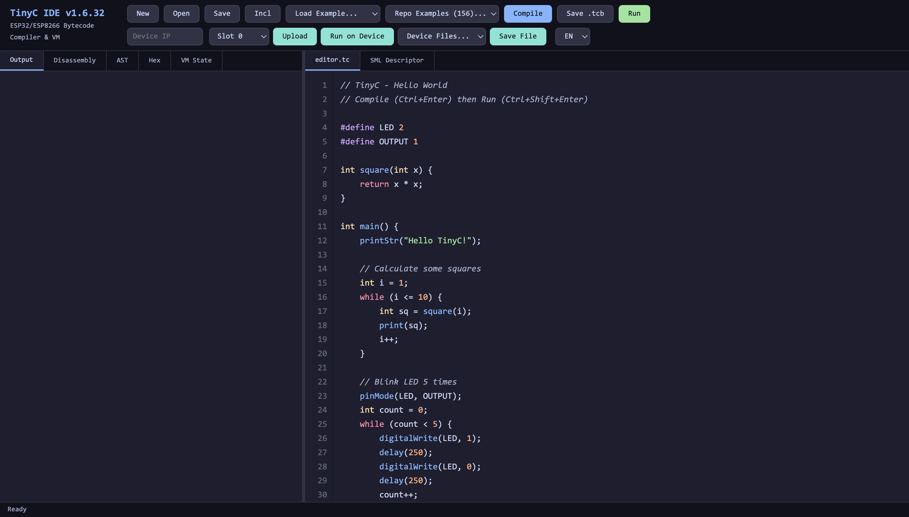

# TinyC fuer Tasmota

**TinyC** ist ein C-Subset-Compiler mit virtueller Maschine, der auf ESP32 und ESP8266 als Tasmota-Treiber `XDRV_124` laeuft. C-Code wird im Browser-IDE geschrieben, zu portablem Bytecode kompiliert, auf das Geraet hochgeladen und ausgefuehrt — ohne Firmware-Neubau, ohne Compiler auf dem Geraet.

{ loading=lazy }

## Warum TinyC

- **Portabler Bytecode** — einmal kompilieren, dasselbe Binaerformat laeuft auf ESP32, ESP32-S3, ESP32-C3 oder ESP8266.
- **Kein Compiler auf dem Geraet** — die VM benoetigt ~12 KB Flash. Kompiliert wird im Browser.
- **Bekannte C-Syntax** — `int`, `float`, Arrays, Funktionen, `for` / `while` / `if` — keine neue Sprache.
- **10-mal schneller als Skript-Interpreter** — direkt gekoppelter Bytecode-Dispatch ohne Neu-Parsen des Quelltexts.
- **Echte Hintergrundtasks** — `TaskLoop()` laeuft in einem eigenen FreeRTOS-Task (ESP32) mit voller `delay()`-Unterstuetzung.
- **Tiefe Tasmota-Integration** — direkter Zugriff auf SML, I2C, Display-Treiber, HomeKit, UDP-Multicast und Webcalls.

## Hier beginnen

- :material-rocket-launch:{ .lg .middle } __[Erste Schritte](getting-started.md)__

    ---
    `USE_TINYC` im Build aktivieren, IDE hochladen, erstes Programm schreiben.

- :material-book-open-variant:{ .lg .middle } __[Referenz](reference.md)__

    ---
    Vollstaendige Funktionsreferenz — GPIO, I2C, SML, Display, HomeKit, Netzwerk.

- :material-code-braces:{ .lg .middle } __[Beispiele](examples/index.md)__

    ---
    Direkt lauffaehige Programme fuer Sensoren, Displays, Zaehler und mehr.

- :material-image-multiple:{ .lg .middle } __[Galerie](gallery/index.md)__

    ---
    Screenshots realer Projekte auf Tasmota-Hardware.

- :material-package-variant:{ .lg .middle } __[Versionen](releases.md)__

    ---
    Vorgebaute Firmware-Binaries fuers Testen.

- :material-tools:{ .lg .middle } __[Eigene Builds](custom-builds.md)__

    ---
    Feature-Flags fuer abgespeckte oder erweiterte Firmware-Varianten.

## Neueste Version

Die aktuellste Test-Firmware, das IDE-Paket und die Dokumentation liegen immer am [testing](https://github.com/gemu2015/Sonoff-Tasmota/releases/tag/testing)-Release-Tag.

---

!!! note "Nicht mit TCC / TinyCC verwandt"
    *TinyC fuer Tasmota* ist ein eigenstaendiges Projekt ohne Verbindung zu Fabrice Bellards
    [Tiny C Compiler (TCC / TinyCC)](https://bellard.org/tcc/). Die beiden Projekte teilen
    einen aehnlichen Namen, haben aber verschiedenen Umfang: TCC ist ein nativer
    x86/ARM-C-Compiler, waehrend TinyC fuer Tasmota ein C-Subset-Compiler ist, der auf
    eine portable Bytecode-VM innerhalb von Tasmota auf ESP32/ESP8266 abzielt.
