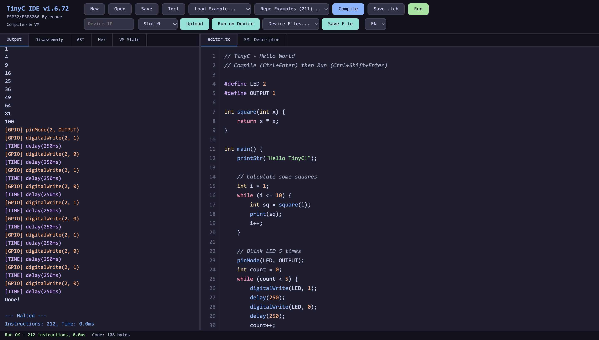

# TinyC for Tasmota

**TinyC** is a C-subset compiler and VM that runs on the ESP32 family (ESP32, S3, C3, C6, P4) and, with a smaller feature set, on the ESP8266 as the Tasmota driver `XDRV_124`. Write C in the browser IDE, compile to portable bytecode, upload and run — no firmware rebuild, no on-device compiler.

{ loading=lazy }

## Why TinyC

- **Portable bytecode** — compile once, run the same binary on ESP32, ESP32-S3, ESP32-C3, ESP32-C6, ESP32-P4 or ESP8266. A program needs a firmware with the same or a newer syscall ABI: the firmware refuses newer bytecode at load time, and the IDE compiles for the ABI of the connected device.
- **No on-device compiler** — compilation happens in the browser, so no parser or code generator ships in the firmware. The interpreter itself is tiny; the whole TinyC driver (VM, system calls, web widgets, serving the IDE, hardware bridges) takes roughly 200 KB of flash — see [Custom Builds](custom-builds.md) for the flash budget.
- **Familiar C syntax** — `int`, `float`, `char[]`, structs, 2D arrays, function pointers, reference parameters, packed `byte[]` / `int16[]` arrays, `#include` and `#if` — no new language to learn.
- **Much faster than script interpreters** — direct-threaded bytecode dispatch with superinstructions and no source re-parsing; the benchmark suite runs faster than Berry on the same chip.
- **True background tasks** — up to six VM slots on ESP32 (one on ESP8266), and `TaskLoop()` runs in a dedicated FreeRTOS task with full `delay()` support.
- **Deep Tasmota integration** — direct access to SML smart meters, I2C, SPI, 1-Wire, serial, display drivers, UDP multicast, MQTT, HTTP/TLS, mail and web pages.
- **More than sensors** — define **Matter** devices (Apple Home, Google Home, Alexa), talk **Bluetooth LE** and Bluetooth Classic, run a **camera** with motion and person detection, use an **FTP client** (e.g. a logger on a FRITZ!NAS), drive an FTDI device through the ESP32-S3's **USB host**, build **LVGL** touch UIs, and speak with the **text-to-speech plugin**.

## Start here

- :material-rocket-launch:{ .lg .middle } __[Getting Started](getting-started.md)__

    ---
    Enable `USE_TINYC` in your build, upload the IDE, write your first program.

- :material-book-open-variant:{ .lg .middle } __[Reference](reference.md)__

    ---
    Full function reference — GPIO, I2C, SML, display, HomeKit, networking.

- :material-code-braces:{ .lg .middle } __[Examples](examples/index.md)__

    ---
    Ready-to-run programs for sensors, displays, meters, and more.

- :material-image-multiple:{ .lg .middle } __[Gallery](gallery/index.md)__

    ---
    Screenshots of real projects running on Tasmota hardware.

- :material-package-variant:{ .lg .middle } __[Releases](releases.md)__

    ---
    Download pre-built firmware for testing.

- :material-tools:{ .lg .middle } __[Custom Builds](custom-builds.md)__

    ---
    Feature flags for trimmed or extended firmware variants.

## Latest release

The latest test firmware, IDE bundle, plugins and docs are always on the [testing](https://github.com/gemu2015/Sonoff-Tasmota/releases/tag/testing) release tag; every build also has its own `v<version>` release. What changed in each version, and which firmware a compiled program needs (the syscall ABI table), is in the [changelog](https://github.com/gemu2015/Sonoff-Tasmota/blob/universal/tasmota/tinyc/CHANGELOG.md).

---

!!! note "Not affiliated with TCC / TinyCC"
    *TinyC for Tasmota* is an independent project unrelated to Fabrice Bellard's
    [Tiny C Compiler (TCC / TinyCC)](https://bellard.org/tcc/). The two share a
    similar name but are different projects with different scope: TCC is a native
    x86/ARM C compiler, while TinyC for Tasmota is a C-subset compiler that
    targets a portable bytecode VM running inside Tasmota on ESP32/ESP8266.
